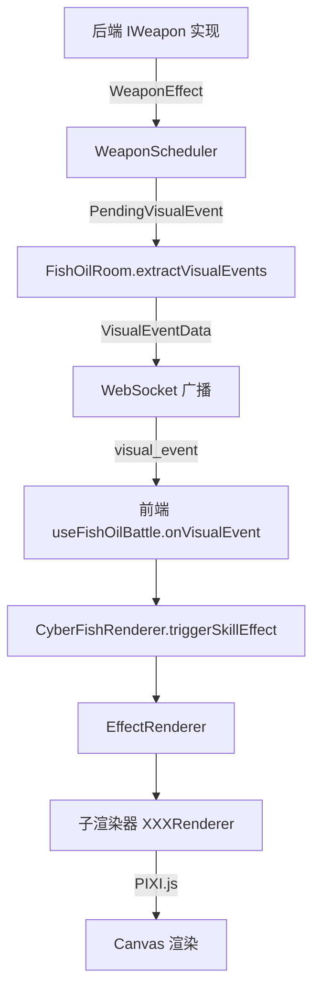

## 产品概述

为鱼油战斗（Fish Oil Battle）游戏逐个实现 10 个角色联动技能。每个技能独立实现后端武器逻辑、前端特效渲染、协议设计和数值配置，完成后确认再继续下一个。

## 核心功能（逐个实现）

### 第 1 个技能：白猫-画作实体化
- 球体跟随小兔玩偶，碰撞造成伤害积攒灵感墨水
- 墨水 6 层时下一次互撞触发爆发：小兔巨大化为肌肉兔（持续 5 秒）
- 参考 `HiveMotherWeapon.ts` 的跟随实体模式

### 第 2 个技能：小金喵-放电猫猫
- 球体周围跟随放电猫虚影，碰撞时发射电弧弹射对手（最多 2 次弹射）
- 弹射累计 6 次触发爆发：雷霆万钧（猫实体化，电弧伤害提升，弹射次数提升至 4 次）
- 参考 `OpticalSlashWeapon.ts` 的直线判定

### 第 3 个技能：风随-预知透镜
- 撞墙获得"先见"层数（上限 6 层），层数 ≥3 时生成猫灵回响投射物
- 叠满 6 层触发无限洞察爆发（持续 4 秒，猫灵回响伤害提升且获得追踪能力）
- 需要新机制：投射物飞行 + 层数状态管理

### 第 4 个技能：Carzeye-情绪天气
- 碰撞后 2 秒降下落雷（范围伤害 + 硬直），命中 5 次触发爆发
- 爆发：持续 4 秒冰雹 AOE（每 0.5 秒一次），全屏暴风雪滤镜
- 落雷颜色随对局时间变化（蓝 → 橙 → 紫）

### 第 5 个技能：开摆-空气斥力场（前端补全）
- 后端已完成，需创建前端 `AirRepulsionFieldRenderer.ts`
- 锚点生成特效（品字形旋转箭头）+ 气罩持续特效 + 爆发斥力场特效

### 第 6 个技能：林澈-情绪掌控
- 每 6 秒自动轮转三种心境（愤怒/幸福/开心），完整轮转后触发爆发
- 爆发：召唤愤怒恶魔、幸福老者、开心小孩三个实体围绕自身旋转
- 需要三心境状态机 + 爆发三实体管理

### 第 7 个技能：KE-流体操控
- 球体移动留下水流尾迹（持续 3 秒），对手在水流上减速受伤害
- 覆盖面积达标触发水龙卷爆发（吸引 + 伤害 + 眩晕）
- 需要新机制：区域持续判定 + 面积检测

### 第 8 个技能：梦-记忆回廊
- 碰撞墙壁/互撞后留下记忆回响（最多 6 个），触碰回响造成伤害 + 拖拽
- 场上 6 个回响时触发历史共振爆发（所有回响同时 AOE 伤害）
- 回响 FIFO 管理 + 爆发共振 AOE

### 第 9 个技能：陈厌孑-无限折叠
- 攻击 30% 概率完全无效并转移攻击者，碰撞标记对手（层数达标触发爆发）
- 爆发：空间重组（缩短距离 + 弹飞 + 空间裂缝 + 穿墙）
- 需要新机制：概率闪避 + 空间折叠 + 穿墙 + 裂缝实体

### 第 10 个技能：闲乘月-熵寂之触（前端补全）
- 后端已完成，需补全前端 `EntropicTouchRenderer.ts`
- 冰晶粒子飘散 + 16℃ 温度标签 + 全屏文字（"> 最优解执行中..."）+ 冰蓝长发残影

---

## 技术栈

- 后端：TypeScript + Node.js，实现 `IWeapon` 接口
- 前端：TypeScript + Vue 3 + Pixi.js（Canvas 2D 渲染）
- 协议：前后端共享 `VisualEventData` 类型（WebSocket 通信）
- 配置：数据驱动，`WeaponRangeConfig.ts` 统一管理数值和视觉参数

---

## 每个技能的标准交付物

1. **后端**：
   - `GameEnums.ts`：添加 `WeaponId`、`WeaponName`、`VisualEventType` 枚举
   - `WeaponRangeConfig.ts`：添加武器数值和视觉参数配置
   - `skills/weapons/XXXWeapon.ts`：实现 `IWeapon` 接口
   - `WeaponRegistry.ts`：注册武器工厂函数
   - `protocol.ts`：在 `VisualEventData` 接口中添加字段

2. **前端**：
   - `renderer/entities/XXXRenderer.ts`：实现特效渲染器
   - `EffectRenderer.ts`：集成新渲染器（成员变量 + 初始化 + setScale + clear/destroy）
   - `CyberFishRenderer.ts`：在 `triggerSkillEffect()` 中添加参数类型和 switch case
   - `useFishOilBattle.ts`：在 `onVisualEvent()` 中添加 switch case

3. **自动注册**：
   - `effectRegistry.ts`：`autoRegisterFromEnum()` 自动为新 `VisualEventType` 生成测试项

---

## 实施注意事项

1. **坐标变换**：前端子渲染器收到的 x/y 已是画布像素坐标，不乘 `this.scale`；尺寸值（radius/length 等）必须乘 `this.scale`
2. **容器定位**：使用"容器 position.set(x, y) + 子 Graphics 以 (0,0) 为中心绘制"模式，防止 resize 漂移
3. **数据驱动**：所有视觉参数从 `WeaponRangeConfig` 构建，禁止在渲染器文件顶部用 const 硬编码
4. **类型同步**：新增 `VisualEventType` 后，必须同步更新 `protocol.ts`、`CyberFishRenderer.ts`、`useFishOilBattle.ts`、`effectRegistry.ts`
5. **字段透传**：在 `FishOilRoom.ts` 的 `extractVisualEvents()` 中，所有视觉事件直接透传，只需确保武器特有字段从 metadata 提取到 `VisualEventData`

---

## 架构设计

### 系统架构图

### 数据流

1. 后端武器逻辑生成 `WeaponEffect[]`（含 `metadata.visualType`）
2. `WeaponScheduler` 收集 `VISUAL_ONLY` 类型的 effect，转换为 `PendingVisualEvent`
3. `FishOilRoom.extractVisualEvents()` 提取字段到 `VisualEventData`
4. WebSocket 广播 `visual_event` 消息到前端
5. 前端 `useFishOilBattle.onVisualEvent()` 路由到 `CyberFishRenderer.triggerSkillEffect()`
6. `EffectRenderer` 调用子渲染器触发特效
7. Pixi.js 渲染到 Canvas

---

## 已完成的进度

- [ ] 第 1 个技能：白猫-画作实体化（未开始）
- [ ] 第 2 个技能：小金喵-放电猫猫（未开始）
- [ ] 第 3 个技能：风随-预知透镜（未开始）
- [ ] 第 4 个技能：Carzeye-情绪天气（未开始）
- [ ] 第 5 个技能：开摆-空气斥力场前端补全（未开始）
- [ ] 第 6 个技能：林澈-情绪掌控（未开始）
- [ ] 第 7 个技能：KE-流体操控（未开始）
- [ ] 第 8 个技能：梦-记忆回廊（未开始）
- [ ] 第 9 个技能：陈厌孑-无限折叠（未开始）
- [ ] 第 10 个技能：闲乘月-熵寂之触前端补全（未开始）

---
