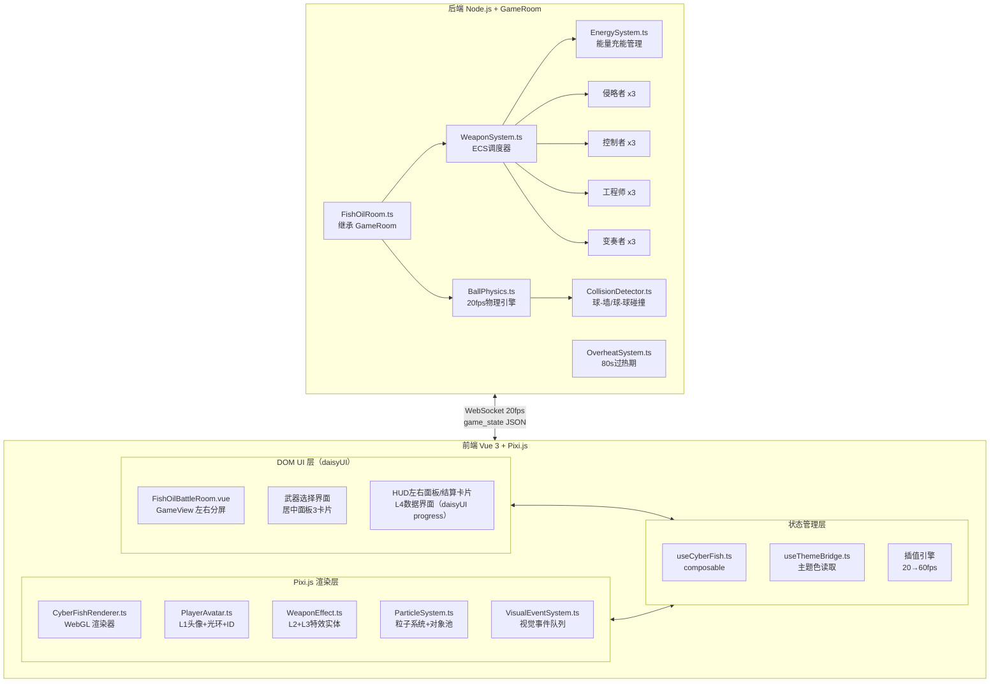

## 产品概述

《赛博鱼油》是Tiaoom平台上一款赛博朋克主题的1v1自动弹球对战游戏。两个玩家的球体在同一个赛博鱼缸战场中自动运动碰撞，每位玩家选择一把武器后，武器技能自动触发（碰撞特效、场地印记、能量爆发）。玩家不操控球的移动方向，仅观察和欣赏战斗过程。UI采用LinkLink连连看的左右分屏+标签页布局，所有DOM元素使用daisyUI CSS变量适配35+主题切换。

## 核心功能

### 双球同框自动对战

- 两个玩家球体共享一个全屏Canvas战场，球自动以200px/s基准速度运动
- 完美镜面反射墙壁反弹，碰撞弹力系数0.9
- 球体以圆形头像（80px）+流派霓虹光环（4px）+浮动ID标签呈现
- 后端20fps逻辑帧驱动物理，前端插值到60fps渲染

### 12把武器+4流派系统

- 4个赛博朋克流派：侵略者(品红#FF00FF)、控制者(电蓝#00BFFF)、工程师(酸绿#39FF14)、变奏者(亮黄#FFD700)
- 每流派3把武器，共12把，每把有独特的充能/爆发触发方式
- ECS风格接口：passive常驻特性(每帧)、active自动触发(冷却制)、onHit/onHitBy命中交互、burst能量爆发
- 武器选择：开战前居中面板展示3张随机武器卡片（各位玩家只看自己池），15秒倒计时自动随机

### 5层视觉渲染体系

- L1头像本体层：圆形头像+霓虹脉动光环+浮动ID（Pixi.js Container）
- L2实体投射层：触手、蜂刺、鱼雷、弹射碎片（Pixi.js AnimatedSprite）
- L3场地印记层：冲击波、重力锚点、油膜、防火墙、回路、裂隙（Pixi.js ParticleContainer）
- L4数据界面层：血条、能量槽、伤害数字、武器图标（DOM Overlay，daisyUI主题适配）
- L5全屏特效层：Bloom发光滤镜、爆发闪屏、运动模糊（Pixi.js Shader）

### 主题适配UI

- 左右分屏布局复用GameView组件，标签页切换玩家列表/战绩
- 所有DOM元素使用daisyUI语义类名（bg-base-100、text-base-content、badge-primary等）
- 武器流派色在DOM层映射为daisyUI语义色（secondary/info/success/warning），Pixi.js特效层保持硬编码流派色不变
- 完全适配35+主题切换，Pixi.js画布背景色从CSS变量动态读取

## 技术栈

### 前端

- **框架**: Vue 3 + TypeScript + Pinia
- **样式**: TailwindCSS 4 + daisyUI 5 (themes: all)
- **游戏渲染**: Pixi.js 8 (WebGL 2D) —— 原生Bloom滤镜、高效ParticleContainer、与Vue集成简单
- **状态管理**: Pinia store + composables
- **WebSocket**: reconnecting-websocket（已有依赖）

### 后端

- **运行环境**: Node.js + TypeScript
- **基类**: GameRoom（Tiaoom引擎，提供WebSocket广播、状态持久化、成就系统）
- **物理引擎**: 手写确定性弹球物理（20fps固定帧率）
- **武器系统**: ECS风格组件化设计

## 实现方案

### 整体架构决策

采用**Pixi.js+DOM混合渲染**方案，而非LinkLink的纯Canvas 2D方案。理由：

- 12把武器需要大量粒子特效（冲击波、蜂群、油膜、裂隙），Canvas 2D逐帧手绘开发成本极高
- Pixi.js原生Bloom滤镜提供霓虹发光效果，无需手写Shader
- ParticleContainer可高效渲染500+粒子无需担心性能
- 与Vue 3生命周期集成已有成熟模式（onMounted初始化Pixi、onUnmounted销毁）

### 关键性能策略

- **后端逻辑帧20fps**：广播间隔50ms，前端插值到60fps，平衡网络负载与视觉流畅
- **ParticleContainer限制**：不旋转/不缩放/不tint的粒子放入ParticleContainer（Draw Call < 5），需旋转缩放的用对象池限制200个
- **纹理打包**：所有Sprite Sheet合并为1-2张Texture Atlas，减少纹理切换
- **特效生命周期**：触发型特效播放完毕立即destroy(true)，持续型特效离开屏幕回收

### 主题桥接机制

Pixi.js画布背景色通过CSS变量读取实现主题跟随：

```typescript
// 每次主题切换时读取CSS变量
const bgColor = getComputedStyle(document.documentElement)
  .getPropertyValue('--b1').trim();
renderer.background.color = oklchToHex(bgColor);
```

流派特效色（#FF00FF、#00BFFF、#39FF14、#FFD700）硬编码不变，确保视觉识别度。

## 架构设计

### 系统架构



### 数据流

```
游戏开始 → FishOilRoom.onStart()
  → 初始化两个玩家球位置（左右各半场）
  → 广播 battle_start + 3把武器选择（各玩家独立随机池）
  → 玩家选择武器 → 后端确认（或15s超时自动随机）
  → 进入20fps游戏循环：
      1. BallPhysics.update() 碰撞检测+位置更新
      2. WeaponSystem.update() 遍历被动/主动/冷却
      3. EnergySystem.update() 能量充能
      4. 构造 game_state JSON 广播（含双方HUD状态）
  → 前端收到 → 存入插值缓冲区 → Pixi.js renderFrame()
  → HUD面板实时更新（hud_update高频事件）
  → 任意一方HP归0 → 后端发送 game_end 事件
  → 前端显示极简结算卡片（<Transition name="zoom">）→ room.end()
```

## 目录结构

### 后端新增/修改

```
game/backend/src/games/
├── fish-oil-battle/
│   ├── index.ts                    # [NEW] 导出游戏元数据（name/minSize/maxSize/description）+ FishOilRoom
│   ├── FishOilRoom.ts              # [NEW] 主游戏房间类，继承GameRoom，管理生命周期和状态广播
│   ├── physics/
│   │   ├── BallPhysics.ts          # [NEW] 20fps物理引擎：速度更新、墙壁反弹、球-球碰撞
│   │   └── CollisionDetector.ts    # [NEW] 碰撞检测（球/墙、球/球、球/特效区域）
│   ├── systems/
│   │   ├── WeaponSystem.ts         # [NEW] ECS调度器：遍历所有武器的passive/active/冷却
│   │   ├── EnergySystem.ts         # [NEW] 能量充能管理：每种武器6格能量的充能规则
│   │   └── OverheatSystem.ts       # [NEW] 80秒过热期：伤害翻倍、倒计时广播
│   └── weapons/
│       ├── WeaponFactory.ts        # [NEW] 武器工厂：按流派随机生成3把武器选项
│       ├── IWeapon.ts              # [NEW] 武器接口定义 + WeaponRuntimeState
│       ├── aggressor/
│       │   ├── ShockwaveGenerator.ts    # [NEW] 武器1：冲击波发生器
│       │   ├── NanoRipper.ts           # [NEW] 武器2：纳米撕裂者
│       │   └── PursuitProtocol.ts      # [NEW] 武器3：追击协议
│       ├── controller/
│       │   ├── GravityWell.ts          # [NEW] 武器4：重力阱
│       │   ├── FirewallProtocol.ts     # [NEW] 武器5：防火墙协议
│       │   └── EntropyDiffuser.ts      # [NEW] 武器6：熵增扩散器
│       ├── engineer/
│       │   ├── HiveMother.ts           # [NEW] 武器7：蜂巢母体
│       │   ├── BastionBuilder.ts       # [NEW] 武器8：阵地构筑者
│       │   └── CircuitWeaver.ts        # [NEW] 武器9：回路编织者
│       └── wildcard/
│           ├── QuantumRift.ts           # [NEW] 武器10：量子裂隙
│           ├── SizeWarp.ts              # [NEW] 武器11：尺寸畸变
│           └── RicochetCore.ts          # [NEW] 武器12：弹射核心
```

### 前端新增/修改

```
game/frontend/src/
├── components/
│   ├── fish-oil-battle/
│   │   ├── FishOilBattleRoom.vue    # [NEW] 主游戏界面，使用GameView布局，Pixi.js画布+DOM覆盖层
│   │   ├── FishOilBattleLite.vue    # [NEW] 小窗模式版本
│   │   ├── FishOilBattleReplay.vue  # [NEW] 回放界面
│   │   ├── FishOilBattleCanvas.vue  # [NEW] Pixi.js画布组件，封装渲染器生命周期
│   │   ├── WeaponSelectOverlay.vue  # [NEW] 武器选择覆盖层（遮罩+3卡片，Iconify图标，daisyUI流派色，zoom过渡）
│   │   ├── BattleHudPanel.vue       # [NEW] 左右HUD面板组件（己方/对手 镜像布局，血条/能量/武器/CD，daisyUI progress）
│   │   ├── CombatResult.vue         # [NEW] 结算面板（极简：胜者名+视角文案，对齐LinkLinkRoom，无数据面板）
│   │   ├── useCyberFish.ts          # [NEW] 游戏状态composable（WebSocket事件处理+插值缓冲）
│   │   ├── useThemeBridge.ts        # [NEW] 主题桥接（CSS变量→Pixi.js颜色）
│   │   └── renderer/
│   │       ├── CyberFishRenderer.ts # [NEW] Pixi.js渲染器初始化（Canvas/WebGL、Bloom滤镜、舞台层级）
│   │       ├── entities/
│   │       │   ├── PlayerAvatar.ts  # [NEW] 玩家头像实体（圆形裁剪+光环绘制+ID文字）
│   │       │   ├── WeaponEffect.ts  # [NEW] 武器特效实体（L2投射物+L3场地印记）
│   │       │   └── ParticleSystem.ts # [NEW] 粒子系统（对象池+ADD混合模式）
│   │       └── systems/
│   │           ├── RenderSystem.ts       # [NEW] 每帧渲染调度（按层级顺序绘制）
│   │           ├── AnimationSystem.ts   # [NEW] 动画管理（插值/缓动/状态机）
│   │           └── VisualEventSystem.ts # [NEW] 视觉事件队列（优先级排序+播放）
│   └── components/
│       └── index.ts                # [MODIFY] 已有自动发现机制，无需修改（文件放对位置即可）
├── package.json                     # [MODIFY] 添加pixi.js依赖
```

## 关键代码结构

### IWeapon接口（后端核心抽象）

```typescript
// game/backend/src/games/fish-oil-battle/weapons/IWeapon.ts
export interface IWeapon {
  id: WeaponID;
  name: string;
  school: School;           // aggressor | controller | engineer | wildcard
  color: string;            // 流派色 hex
  difficulty: 1 | 2 | 3;
  visualLayers: VisualLayer[];  // ['L1', 'L2', 'L3', 'L5']
  
  /** 常驻特性：每逻辑帧调用 */
  passive(state: GameState): void;
  /** 自动触发：冷却完毕时调用 */
  active(state: GameState): void;
  /** 命中对手时调用 */
  onHit(target: PlayerState): void;
  /** 被命中时调用 */
  onHitBy(attacker: PlayerState): void;
  /** 检查是否满足爆发条件 */
  checkEnergyBreak(): boolean;
  /** 神话爆发效果 */
  burst(state: GameState): void;
}

export interface WeaponRuntimeState {
  energy: number;                    // 0-6
  cooldowns: Map<string, number>;   // 技能名→剩余冷却帧数
  stacks: Map<string, number>;      // 层数计数器（撕裂/追击等）
  flags: Map<string, boolean>;      // 状态标记（霸体/加速/量子态等）
}
```

### GameRoom扩展模式（后端主类）

遵循LinkLink的`onStart() → onCommand() → getStatus() → getData()`模式，增加20fps游戏循环：

```typescript
// FishOilRoom.ts 核心结构
export default class FishOilRoom extends GameRoom {
  playerStates: Map<string, PlayerState>;   // 球位置/速度/HP/武器状态
  gameLoopTimer: NodeJS.Timeout | null;     // setInterval(50ms)
  weaponSystem: WeaponSystem;
  
  onStart(): void {
    // 1. 初始化球位置（玩家1左侧、玩家2右侧）
    // 2. 广播武器选择（各3把随机）
    // 3. 确认选择后启动 gameLoopTimer
    // 4. 20fps循环：物理→武器→能量→广播→过热线
  }
  
  private gameTick(): void {
    // 1. BallPhysics.update() → 位置/速度更新+碰撞检测
    // 2. WeaponSystem.update() → 遍历武器passive/active
    // 3. EnergySystem.update() → 充能判定
    // 4. 构造 game_state JSON → room.emit('command', ...)
    // 5. OverheatSystem.check() → 80秒检测
  }
}
```

### 视觉事件系统（前端渲染调度）

```typescript
// VisualEventSystem.ts 事件类型
type VisualEventPriority = 'P0' | 'P1' | 'P2' | 'P3';

interface VisualEvent {
  type: 'weapon_trigger' | 'burst_start' | 'burst_end' | 'hit' | 'wall_bounce' | 'overheat_start' | 'game_end';
  priority: VisualEventPriority;   // P0最高（游戏结束/爆发）→ P3最低（环境粒子）
  startTime: number;
  duration: number;
  play(renderer: CyberFishRenderer): void;
}
```

## 实施注意事项

### 性能关键路径

- **20fps逻辑帧**：后端`setInterval(50ms)`驱动，前端收到状态后存入长度为3的插值缓冲区（实现100ms平滑插值）
- **ParticleContainer**：场地印记（L3）如油膜粒子、回路粒子全部放入ParticleContainer，限制500个，超出回收最旧
- **Bloom滤镜**：仅对L1头上的光环和L5全屏特效应用Bloom，避免全局性能损耗

### 日志规范

- 后端游戏循环使用`console.debug`输出tick计数器（生产环境关闭）
- 武器触发/爆发事件使用`console.log`（含玩家名+武器名）
- 断线重连使用`console.warn`
- 禁止输出完整game_state JSON（过大）

### 向后兼容

- 前端组件命名遵循`{GameNameCamel}{Type}`约定（FishOilBattleRoom/FishOilBattleLite/FishOilBattleReplay），由`components/index.ts`的`getComponent()`自动发现
- 后端导出`name/minSize/maxSize/description/default`，由`games/index.ts`的`loadGames()`自动注册
- 不修改GameView.vue和GameRoom基类，仅继承/组合使用

## 设计风格

采用赛博朋克与极简Web仪表盘融合风格。核心游戏区域保留赛博朋克的霓虹流光、粒子特效和暗色背景，而所有外围UI（侧边栏、标签页、信息面板）严格对齐LinkLink的daisyUI极简风格——圆角卡片、细边框、半透明背景、低饱和配色、标签页导航。这种双轨视觉策略确保游戏画面足够炫酷的同时，操作界面清爽实用。

### 流派→daisyUI语义色映射

DOM UI层武器流派通过daisyUI语义色区分，不硬编码流派色值：

| 流派 | Pixi.js硬编码色（特效层） | daisyUI语义色（DOM层） |
|------|--------------------------|----------------------|
| 🟣 侵略者 | `#FF00FF` | `secondary` |
| 🔵 控制者 | `#00BFFF` | `info` |
| 🟢 工程师 | `#39FF14` | `success` |
| 🟡 变奏者 | `#FFD700` | `warning` |

- **Pixi.js层**：流派特效色硬编码不变，确保视觉识别度和霓虹发光效果
- **DOM UI层**：卡片边框、badge、图标色使用`badge-secondary`/`text-info`/`border-success`等daisyUI语义类名，随`data-theme`自动切换
- 武器卡片12把武器使用Iconify `game-icons`系列图标（如`game-icons:sonic-wave`），不用emoji

## 页面设计

### 主游戏界面（FishOilBattleRoom）

- **左侧游戏区（70%宽度）**：全屏Canvas战场，暗色背景（跟随主题--b1），两个头像球体带霓虹光环在碰撞，四壁有微弱青色边框发光，Bloom滤镜营造赛博氛围
- **左右HUD面板（z-10）**：采用左右两侧小矩形面板布局，己方面板在左侧（`border-primary/30`），对手面板在右侧镜像排列（`border-error/30`）。每块面板180px宽，包含玩家名、HP/EN progress进度条、武器图标+名称+CD状态。对手能量数值隐藏（`opacity-0`），仅显示半透明进度条
- **底部中央指示器（z-10）**：回合倒计时badge（≤10s切换红色闪烁）+ 过热标记badge（仅触发时显示）
- **右侧侧边栏（30%宽度）**：tabs-lift标签页（玩家列表/战绩/AI聊天），使用daisyUI的badge/btn/card组件，文字颜色使用text-base-content
- **顶部提示条**：武器触发/爆发/过热线通知，使用alert组件加流派色左边框

### 武器选择界面（WeaponSelectOverlay）

- **全屏半透明遮罩（z-20）**：`bg-base-300/60 backdrop-blur-md`覆盖游戏区域
- **居中选择面板**：`bg-base-100/90 shadow-2xl rounded-2xl border-primary/20`，700px宽
- **倒计时**：15秒数字倒计时（≤5s切换`text-error animate-pulse`警示），超时自动随机选择
- **3张武器卡片**：横向排列，`bg-base-200/80 rounded-xl border-2`，悬停`scale-105 shadow-lg`，选中`ring-2 ring-primary/50`
- **卡片内容**：Iconify图标（`game-icons`系列）+ 武器名 + 流派badge（`badge-secondary`/`info`/`success`/`warning`）+ 难度星级（⭐绿色/⭐⭐黄/⭐⭐⭐红）
- 每位玩家只看自己的卡片池，对手卡片不可见；使用`<Transition name="zoom">`入场/退场动画

### 结算面板（CombatResult）

对齐LinkLinkRoom极简结算风格，不做额外复杂度：
- **半透明遮罩**：`bg-base-300/40 backdrop-blur-sm`覆盖游戏区域（z-10）
- **居中结果卡片**：`bg-base-100/95 shadow-2xl rounded-2xl border-primary/30`，使用`<Transition name="zoom">`入场（0.3s缩放+淡入）
- **内容极简**：仅显示胜负图标（🎉/💀）+ 胜者昵称 + 视角相关提示语（"恭喜你，击败对手！"/"加油，下次再来！"/"对局已结束。"三态文案）
- 不展示数据面板、数字滚动动画、操作按钮；不退场，卡片保持显示直到离开房间
- 后端`game_end`事件附带的`stats`数据接收但不展示，保留用于后续扩展

## Agent Extensions

### SubAgent

- **code-architect**
- 用途：在Phase 2开始前，基于现有link-link实现模式，设计FishOilRoom的完整类结构和武器系统架构，确保与GameRoom基类的继承关系正确、与WeaponSystem的调度逻辑解耦
- 预期产出：FishOilRoom核心类图、武器系统调度流程图、状态广播时序图

### Skill

- **UI设计Skill**
- 用途：在Phase 5生成FishOilBattleRoom.vue、WeaponSelectOverlay.vue、BattleHudPanel.vue、CombatResult.vue四个核心Vue组件。武器选择页和HUD面板严格使用daisyUI语义色（secondary/info/success/warning）替代硬编码流派色，武器卡片使用Iconify `game-icons`图标，进度条使用daisyUI `<progress>`组件；结算页对齐LinkLinkRoom极简风格
- 预期产出：4个完整Vue SFC组件文件，含模板/脚本/样式，可直接用于项目

### SubAgent

- **code-reviewer**
- 用途：在Phase 3完成后审查武器系统代码，检查12把武器的IWeapon接口一致性、充能逻辑正确性、状态竞态条件
- 预期产出：武器系统审查报告，标注高风险问题点