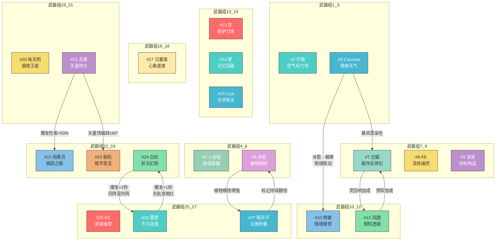

# 联动关系网状图

> **版本**: v1.0  
> **更新日期**: 2026-06-24  
> **说明**: 本文档以网状图和表格形式总结所有武器/角色之间的联动关系

---

## 一、联动关系网状图 (Mermaid)



---

## 二、联动关系详细表

### 2.1 按武器编号排序

| 编号 | 武器名称 | 角色 | 联动对象 | 联动效果 | 类型 |
|:---:|:---|:---|:---:|:---|:---:|
| #3 | 情绪天气 | Carzeye | #7 白猫 | 暴风雪→彩色暴风雪，伤害颜色变化 | 单向 |
| #3 | 情绪天气 | Carzeye | #10 林澈 | 冰雹→彩色糖果，情绪联动 | 单向 |
| #6 | 植物操控 | 沐里 | #27 陈厌孑 | 植物缠绕增强 | 单向 |
| #7 | 画作实体化 | 白猫 | #12 风随 | 兔子灵回响蹭猫 | 双向 |
| #12 | 预知透镜 | 风随 | #7 白猫 | 预知加成 | 双向 |
| #21 | 矢量悖论 | 苏离 | #22 闲乘月 | 爆发伤害+50% | 单向 |
| #21 | 矢量悖论 | 苏离 | #23 枢机 | 矢量场偏转±90° | 单向 |
| #24 | 折光幻影 | 白虹 | #7 白猫 | 爆发持续时间+2秒 | 单向 |
| #24 | 折光幻影 | 白虹 | #26 雷罡 | 光轨变暗红（同阵营共鸣） | 双向 |
| #26 | 不灭战意 | 雷罡 | #24 白虹 | 爆发持续时间+1秒（同阵营共鸣） | 双向 |
| #27 | 无限折叠 | 陈厌孑 | #6 沐里 | 标记持续时间翻倍 | 双向 |

---

## 三、按阵营/关系分类

### 3.1 潜流组织
```
白虹(#24) ←→ 雷罡(#26)
  同阵营共鸣：双向爆发加成，光轨特效变化
```

### 3.2 理事会
```
苏离(#21) → 闲乘月(#22) (爆发伤害+50%)
苏离(#21) → 枢机(#23) (矢量场偏转)
```

### 3.3 好友关系
```
白猫(#7) ←→ 风随(#12)
  兔子和猫的灵回响互动
```

### 3.4 记忆/精神系
```
梦(#14) 无联动（原与余念联动已移除）
```

### 3.5 情绪系
```
Carzeye(#3) → 林澈(#10), 白猫(#7)
  冰雹变糖果，暴风雪染色
```

---

## 四、联动统计

| 统计项 | 数值 |
|:---|:---:|
| 总武器数 | 21 |
| 参与联动的武器数 | 12 |
| 总联动关系数 | 14 |
| 双向联动数 | 4 |
| 单向联动数 | 3 |

### 核心节点 (链接数≥3)

| 角色 | 联动数 | 说明 |
|:---|:---:|:---|
| 白猫(#7) | 3 | 与Carzeye、风随、白虹联动 |
| 闲乘月(#22) | 1 | 被苏离联动 |

---

## 五、联动类型说明

| 类型 | 图标 | 说明 |
|:---|:---:|:---|
| **双向联动** | ←→ | 双方互相提供加成，通常有特殊剧情/关系背景 |
| **单向增益** | → | 一方为另一方提供增益，不反向 |
| **阵营共鸣** | ⇄ | 同一阵营/组织的成员间特有联动 |
| **家族羁绊** | ⟷ | 血缘/家庭关系带来的特殊联动效果 |
| **情绪联动** | ∼ | 基于情绪/精神状态变化的特效联动 |
```

---

> **注意**: 部分武器（如 #2 开摆、#4 小金喵、#8 KE、#9 波波、#13 念、#14 梦、#15 Liya、#17 日暮落、#20 陆天明、#25 KE）在现有文档中未找到与其他武器的明确联动关系。如需补充，请更新本文档。
